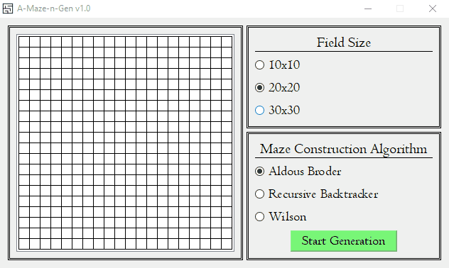

# A-Maze-n-Gen
***C++/Qt Maze Generator***

Приложение позволяет генерировать двухмерные идеальные лабиринты без смещения (по классификации [отсюда](https://habr.com/ru/post/445378/))

## Особенности

- Три определенных размера лабиринта
- Три алгоритма генерации
- Анимация создания лабиринта
- Возможность остановить процесс генерации

## Алгоритмы генерации
- ### [Алгоритм Олдоса-Бродера](https://habr.com/ru/post/321210/#:~:text=%D0%91%D1%80%D0%BE%D0%B4%D0%B5%D1%80%D0%B0%20%D0%B8%20%D0%A3%D0%B8%D0%BB%D1%81%D0%BE%D0%BD%D0%B0.-,%D0%90%D0%BB%D0%B3%D0%BE%D1%80%D0%B8%D1%82%D0%BC%20%D0%9E%D0%BB%D0%B4%D0%BE%D1%81%D0%B0%2D%D0%91%D1%80%D0%BE%D0%B4%D0%B5%D1%80%D0%B0,-%D0%9E%D0%BF%D0%B8%D1%81%D0%B0%D0%BD%D0%B8%D0%B5%0A%0A%D0%9F%D0%BE%D0%BC%D0%BD%D0%B8%D1%82%D0%B5%20%D1%8F)

Несмотря на свою простоту, данный алгоритм создает случайные лабиринты. Ожидание завершения может быть довольно долгим.

  
Aldous Broder GIF

  
  

- ### [Алгоритм Recursive Backtracker](https://habr.com/ru/post/445378/#:~:text=%D1%80%D0%B5%D0%B0%D0%BB%D0%B8%D0%B7%D0%BE%D0%B2%D0%B0%D1%82%D1%8C%20%D0%B4%D0%BE%D0%B1%D0%B0%D0%B2%D0%BB%D0%B5%D0%BD%D0%B8%D0%B5%D0%BC%20%D1%81%D1%82%D0%B5%D0%BD%3A-,Recursive%20backtracker,-%3A%20%D0%BE%D0%BD%20%D0%B2)

Алгоритм создает довольно красивые лабиринты. Самый быстрый по скорости генерации.

  
Recursive Backtracker GIF

  
  

- ### [Алгоритм Уилсона](https://habr.com/ru/post/321210/#:~:text=%D0%90%D0%BB%D0%B3%D0%BE%D1%80%D0%B8%D1%82%D0%BC%20%D0%A3%D0%B8%D0%BB%D1%81%D0%BE%D0%BD%D0%B0,-%D0%9E%D0%BF%D0%B8%D1%81%D0%B0%D0%BD%D0%B8%D0%B5%0A%0A%D0%9F%D0%BE%D0%B7%D0%B4%D1%80%D0%B0%D0%B2%D0%BB%D1%8F%D1%8E%2C%20%D0%BC%D1%8B)

Также создает случайные лабиринты. Первый этап в данном алгоритме самый длительный, после него достраивается очень быстро.

  
Wilson GIF

  
  

